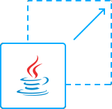
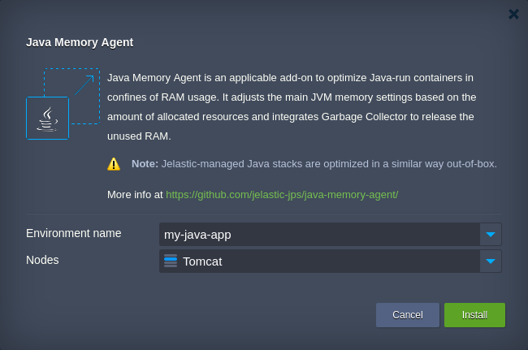
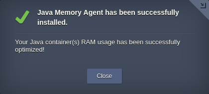
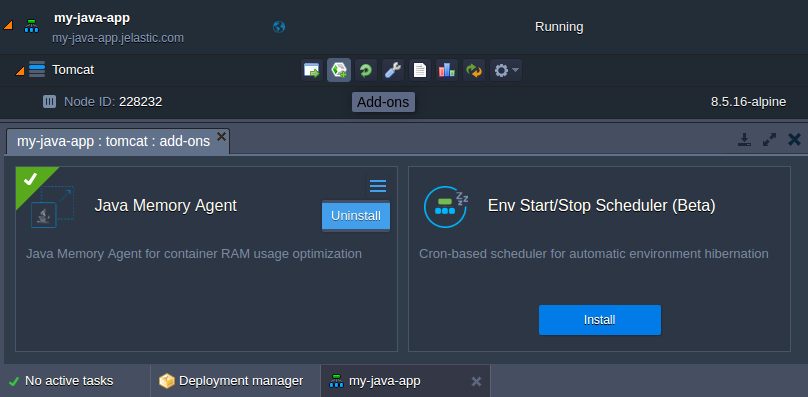

# Java Memory Agent Add-On

The **Java Memory Agent** package implements automatic RAM usage optimization for Java-powered stacks of any type (application servers, databases, etc) by adjusting the most essential Java memory parameters according to the amount of resources, allocated to a container.

**What it is intended for?**

This add-on is designed to optimize any custom Java server (i.e. hosted with [Docker containers](https://docs.jelastic.com/dockers-overview) or on top of [VPS](https://docs.jelastic.com/vps)). Herewith, it is applicable not only to application server stacks (e.g. _Tomcat_, _WildFly_, _GlassFish_, etc), but to any Java-powered instance as well (e.g. _Neo4j_ or _Cassandra_ databases).

> **Note:** Jelastic-managed Java stacks are provisioned with a similar tuning out-of-box, thus their additional optimization with this add-on is not needed.

To learn more about [Jelastic Add-ons](https://github.com/jelastic-jps/jpswiki/wiki/Jelastic-Addons) and their usage, refer to the linked guide.

## Java Memory Agent Add-On Specific

To implement the required configurations, the Java Memory Agent creates an interceptor in front of the application main method, which enables it to re-define the running classes’ content on a bytecode level. The two main changes this add-on applies upon installation are:
* adjustment of the most essential Java parameters according to a dedicated [configuration script](https://github.com/jelastic-jps/java-memory-agent/blob/master/scripts/memoryConfig.sh)
* integration of the [Garbage Collector](https://docs.jelastic.com/garbage-collector-overview) service to avoid processes’ memory leak (i.e. to prevent OOM issues’ occurrence and vain use of container resources)

In addition, the Java Memory Agent by Jelastic considers all the specific issues of [Java hosting within containers](http://blog.jelastic.com/2017/04/13/java-ram-usage-in-containers-top-5-tips-not-to-lose-your-memory/), improving performance of your application in general.

> **Note:** Upon add-on installation, the corresponding server should be restarted with new parameters, which will cause a brief downtime of the service it runs.
> 
> In order to avoid this, consider to [increase the number of instances](https://docs.jelastic.com/multi-nodes) within a target environment layer so that the required changes could be applied sequentially, by restarting them one-by-one.

Herewith, the originally used application parameters are automatically backed up and could be easily restored with a simple add-on removal, if needed (see the details within the dedicated section below)

## How to Install Java Memory Agent to Jelastic Environment

The **Java Memory Agent** add-on can be applied to the required server by [importing](https://docs.jelastic.com/environment-import) the _**manifest.jps**_ file above or directly from the **Add-ons** section of [Jelastic Marketplace](https://docs.jelastic.com/marketplace).

Within the appeared form, use the appropriate drop-down lists to specify the environment and Java-running server that should be optimized:
* _**Environment name**_ - choose a target environment within your account
* _**Nodes**_ - select the corresponding environment layer with the required server

Click **Install** when ready and wait a few minutes for your application memory usage to be properly adjusted by Jelastic.

After the successful installation, you can open the embedded [statistic monitoring](https://docs.jelastic.com/view-app-statistics) tool to track your server’s RAM consumption with new settings.

## How to Restore the Initial Java Parameters

Upon installation, the Java Memory Agent add-on automatically preserves the previously used Java settings within a dedicated backup file. Consequently, these configs can be effortlessly restored through the add-on removal, if needed.

For that, click on the **Add-ons** button next to the corresponding environment layer to open the same-named tab and select the **Uninstall** option within the _Java Memory Agent_ plank menu.
